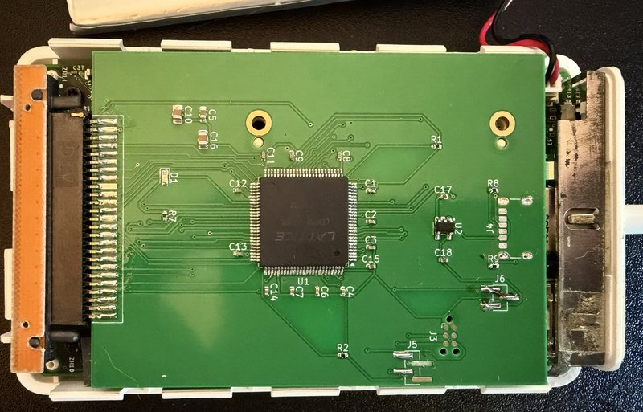
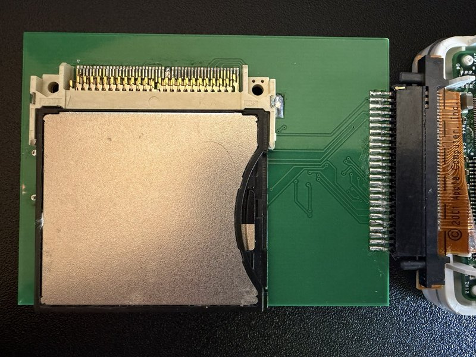
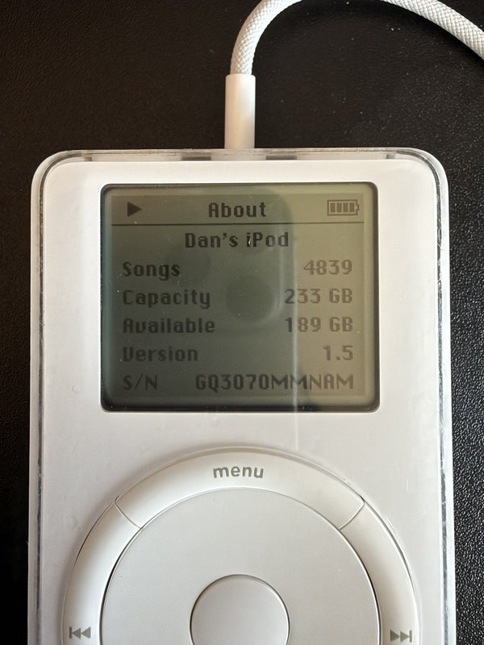
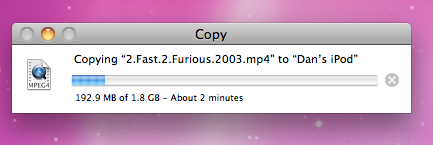

# Sphinxmoth

### The little board that answers the iSphynxII: a working flash mod for FireWire iPods (1st/2nd gen)

An **active FPGA interposer** that lets flash storage (CF, or SD behind an adapter) fully replace the 1.8″ hard drive in a **1st/2nd-generation
iPod**: boot, standalone playback, **and full-speed FireWire restore + iTunes sync**.

This is the first time in the ~25 years since these iPods shipped
that all of that works at once on flash storage. Passive adapters never could, and
it turns out they never could have. The reason was documented by Texas
Instruments in 2001.

A note on qualifications: I had none. This is the first PCB I've ever had
made, I leaned on the autorouter more than any self-respecting layout
engineer would admit, and before this project I'd never programmed an FPGA.
This board isn't pretty; it was never meant to be. It exists to answer one
question: is this possible at all?

| | |
|---|---|
|  |  |

*The assembled v1 board: FPGA side and CF side. And the point of it all:*

<i>A 1.8 GB file at roughly 15 MB/s over FireWire, through the bridge. No, the
1st gen can't play it. That's not the point.</i>

## Why the cheap green CF/IDE adapters never worked

FireWire-era iPods (1G/2G, and the 3G) use TI's **TSB43AA82 "iSphynxII"**
FireWire-to-ATA bridge. From TI's own *TSB43AA82 Storage Reference Design*:

> It should be noted that iSphynxII does not implement the 16-bit CRC value
> required at the end of ATA ultraDMA transfers. There are two ways to deal
> with this. The first is to use HDDs that allow transfers to continue even if
> the correct CRC value is not received. The second is to insert an ASIC/PLD
> between iSphynxII and the HDD that calculates the CRC as the transfer is
> taking place and drives it to the drive at the appropriate time. This
> reference design assumes the HDD does not require the CRC.

Apple took TI's first option: the original Toshiba 1.8″ drives tolerate the
missing CRC. **Every CF card enforces it.** So the moment a flash device sees
an Ultra-DMA burst from the iSphynxII, it (correctly) rejects the transfer with
an interface-CRC error, and no passive adapter can ever fix that, because the
CRC simply isn't on the wire.

**This project is the "ASIC/PLD between iSphynxII and the HDD" that TI
described, built 25 years later.** A Lattice MachXO2 sits in the datapath,
re-originates every UDMA burst, and supplies the CRC the iSphynxII omits.

But the CRC is only the first wall. Credit to Reddit user **SquashHour9940**,
whose excellent investigation
([*Further research about flash modified iPod 1st/2nd Gen syncing problem*](https://www.reddit.com/r/ipod/comments/18fujac/further_research_about_flash_modified_ipod_1st2nd/))
independently mapped two more layers:

2. **Removable vs. fixed media**: consumer CF cards report themselves as
   *removable media*; the iPod firmware and iTunes want a *fixed disk*.
   Industrial CF cards (fixed-disk firmware) get past this gate; consumer
   cards don't.
3. **The TSB43AA82 falls back to slow PIO when it detects a CF card**:
   staged 1 MB at a time through the iPod's tiny SRAM, capping passive-adapter
   FireWire transfers around 300 KB/s even when everything else works.

And our bring-up found a fourth layer nobody had hit before, because nobody
had gotten this far:

4. **The PP5002 CPU (the retail OS) is a DMA host too**: its UDMA write
   strobes are electrically hostile (ringing, data-dependent crosstalk) and
   corrupted the filesystem on every standalone boot until this bridge learned
   to detect that master and quietly demote it to PIO.

This bridge defeats all four: it originates the missing CRC, rewrites the
card's IDENTIFY on the wire (media type and DMA capabilities, per master;
a removable or CFA-signature word 0 becomes a classic fixed-disk value,
checksum corrected), keeps the DMA path alive at full speed, and gives
each of the iPod's two very different bus masters the bus discipline it
actually needs. The fixed-disk rewrite has been tested end-to-end with a
retail Lexar Professional 800x (32 GB, UDMA 7), the exact card class the
community documented as removable-reporting: it restores and syncs
through the bridge like any industrial card.

## Status

| | |
|---|---|
| **v1 board** (CF slot, `board/`) | **Working.** Boots, plays, restores, syncs. Reads 19 MB/s, writes 4.6 MB/s over FireWire. Running a 256 GB SD (via FC1307A CF adapter) today. |
| Validated bitstream | `releases/v1.0-first-music/` (build outputs are not run-deterministic; this exact binary is the hardware-proven one) |
| **v2** (native microSD) | **Being considered.** microSD would be nice, but at first glance it needs a larger/more expensive FPGA (the v1 XO2-2000 is 89% full and the disk logic moves on-chip; the draft targets an XO2-7000). Exploratory work lives on the [`v2-native-sd`](../../tree/v2-native-sd) branch: unfabbed, unvalidated, promise-free. **Do not build it.** |

Tested on: iPod 1st gen (firmware 1.5), Transcend industrial 2 GB CF,
FC1307A SD-CF adapter + 256 GB SD, Mac OS X 10.6 + iTunes over FireWire.
2G/3G iPods use the same TSB43AA82 and *should* work; reports welcome.

## How it works (the short version)

The FPGA discovered during bring-up that it serves **three masters**, and it
gives each a different personality:

| Master | How it's detected | What it gets |
|---|---|---|
| **iSphynxII** (FireWire) | never issues `EXECUTE DIAGNOSTIC` | Full UDMA2 bridge: bursts re-timed through a FIFO, **end-of-burst CRC generated**, multi-burst writes, a deliberately "bouncy" flow-control throttle (it abandons bursts on long clean pauses) |
| **PP5002** (retail OS) | opens with `C90 EXECUTE DIAGNOSTIC` | IDENTIFY patched in flight (DMA capability words zeroed, checksum fixed) → the OS falls back to PIO `READ/WRITE MULTIPLE` through a transparent passthrough |
| **CF card** | n/a | Always runs UDMA2, regardless of what either host negotiated (`SET FEATURES` sector-count byte rewritten on the wire) |

Plus the small in-flight surgeries each master demanded: BSY served for status
polls mid-command, CS/DA forced idle at the card during bridged bursts, strict
data setup/hold on every strobe edge, spec-ordered burst termination, and
STANDBY/SLEEP commands rewritten to CHECK POWER MODE (retail cards honor them,
then never wake the way the OS expects; the original drive woke transparently). The
testbenches encode all of it: the card model sector-terminates, pauses,
checks CRC and enforces tSS; the host model parks on the status register,
polls, and rings its strobe line. Every cruelty in the sims reproduced a bug
first found on real hardware during a two-day, fourteen-bug bring-up.

## Building it

**Board (v1):** upload `board/ipod-cf-udma-gerbers.zip` to any fab (2 layer,
53×72 mm, 1.6 or 0.8 mm). CF socket (J2) is on the BACK; everything else on
the front. `board/BOM.csv` + `board/ipod-cf-udma-pos.csv` for assembly.

**Bitstream:** Lattice Diamond 3.14, `cd diamond && pnmainc rebuild.tcl` →
`impl1/ipodboard_impl1.jed`. Or just flash `releases/v1.0-first-music/`.

**Programming:** Tag-Connect TC2030-IDC-NL pads (J3, zero height) to any
JTAG probe Diamond Programmer / openFPGALoader speaks. The MachXO2 configures
from internal flash; program once, done.

**Power:** bus-powered from the iPod's 3.3 V. J6 shunt selects iPod (1-2) or
bench USB-C (2-3); never both. The green LED blips a slow heartbeat when idle
and flashes while data is moving through the bridge. The UART header (J5, 115200 8N1) streams the
gateware's event log; if something misbehaves, that log is the microscope
this whole project was debugged through.

**Simulation:** Icarus Verilog: `cd gateware && iverilog -g2012 -DSIM -I rtl
-o wr.vvp sim/tb_full_write.v rtl/*.v && vvp wr.vvp` (likewise
`tb_full_read.v`).

## Repository layout

| Path | Contents |
|---|---|
| `board/` | v1 board: KiCad project, fabbed gerbers, BOM, schematic PDF, DRC/ERC |
| `gateware/rtl/` | the bridge RTL (`interposer_top` + engines) |
| `gateware/sim/` | hardware-calibrated torture testbenches |
| `diamond/` | Lattice Diamond build project |
| `releases/` | hardware-validated bitstreams |
| `v2-native-sd` branch | exploratory native-microSD v2: board draft, `ata_device`/`sd_host` cores, design doc |

## Known v1 errata

- J2 pin 39 (−CSEL) must be grounded (already fixed in these gerbers).
- J2 pins 45/46 (−DASP/−PDIAG) float; some cards may care (10 k pull-ups to
  3.3 V recommended).
- The USB-C shield holes share the CF socket's courtyard; desoldering J4
  heat-stresses socket joints (ask us how we know). v2 deletes both parts.
- DD-bus ↔ control-line crosstalk exists at the margins; the gateware routes
  around it (PIO for the PP5002), v2 adds proper guarding.

## Credits

- **SquashHour9940** (r/ipod): the fixed-disk/removable-media and
  TSB43AA82-PIO-fallback research that mapped layers 2 and 3:
  https://www.reddit.com/r/ipod/comments/18fujac/further_research_about_flash_modified_ipod_1st2nd/
- Texas Instruments, for documenting in 2001 exactly which chip to blame
  and exactly what to build about it.
- [freerouting](https://github.com/freerouting/freerouting): the open-source
  autorouter that closed every net on both boards.

## License

Gateware and software: MIT. Hardware (schematics, board files, gerbers):
CERN-OHL-P-2.0. No warranty; a 25-year-old iPod is involved.
